<h1 align="center">Bakes by Noémie</h1>

[View the live project here.](https://rhysmoggs.github.io/ms1-bakes-by-noemie/)

Here is the official website for Bakes by Noémie - a bakery based in South Wales, UK.

The website is the company's first attempt and building their brand and awareness. Having launched in April 2020, with a relatively small but hugely skilled and ambitious team of bakers - Noémie, of Bakes by Noémie and the company's owner and head-baker, would like to launch an official website to take the company to the next level. The company expects to increase brand awareness and attract more customers to purchase their baked goods. The website will clearly display information for new and returning customers including the company's contact info, updates and social media links. The website is fully responsible on a range of hand-held devices to larger screens. This is to ensure that as many eyes as possible can visit the website, in turn increasing the ultimate goal of turning a profit via the Bakes by Noémie shop.

<h2 align="center">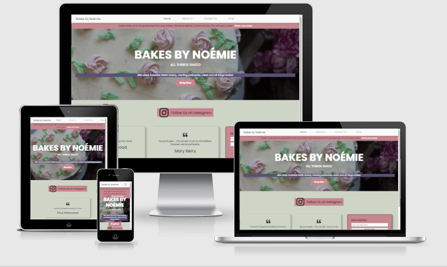</h2>

## User Stories

Following are the goals that the website should provide for each user.

#### As a New User :
* I want it to be very clear what the website's purpose is and what do they do.
* I want to be able to seamlessly navigate the website on whatever device I'm using.
* I want to easily find their social media links to find out more about the company, the way they conduct themselves and their interaction with customers.
* I want to find reviews.

#### As a Returning User :
* I want to be able to access the shop with ease and to purchase their products.
* I want to check to see if there are any newly added products to the shop.
* I want to find information about the company's background, their story and growth.
* I want to find the best way to get in contact with the company with any questions I may have.
* I want to be able to contact the company in many different ways.
* I want there to be a Newsletter so that I am informed of any company related news.


## Design
Once the user goals and the website's intentions were set out, the next step was to design the aesthetic aspects of the Bakes by Noémie website.

### Wireframes
Wireframes were drawn using [Balsamiq](https://balsamiq.com/) at the beginning of the project. They were referenced throughout the design and building of the website. Following are a series of images showing the Bakes by Noémie website on the three main screen sizes: desktop, tablet and mobile. Every webpage is also included.

#### Desktop

- Home Page Wireframe

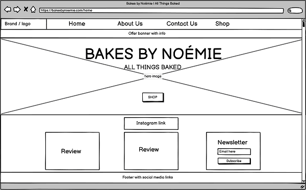

- About Us Wireframe

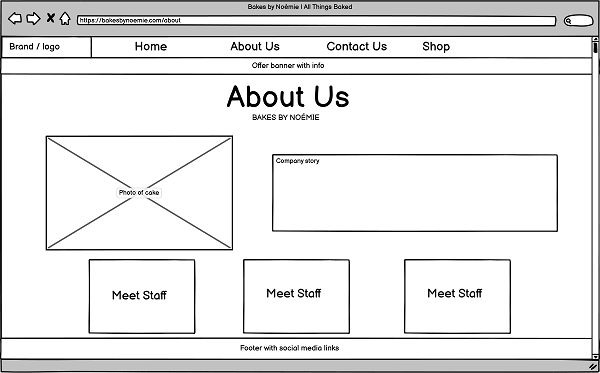

- Contact Us Wireframe

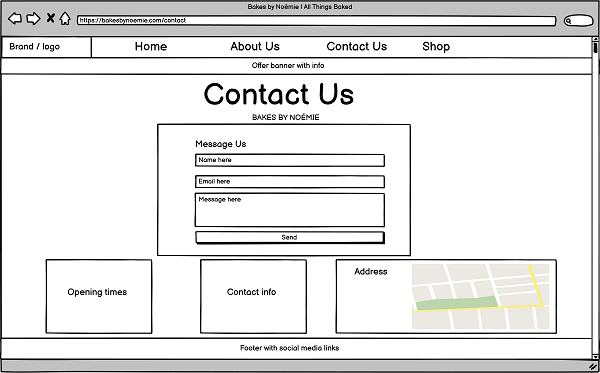

- Shop Wireframe

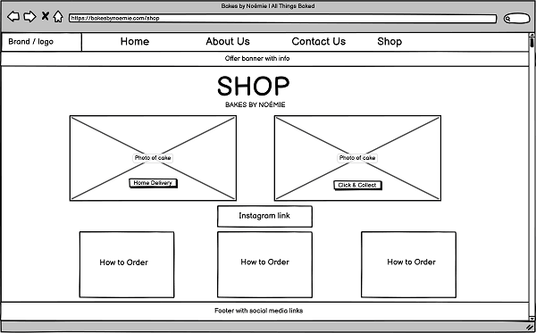

#### Tablet

- Home Page Wireframe

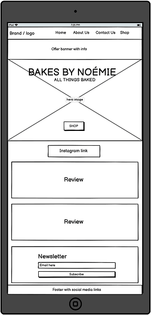

- About Us Wireframe

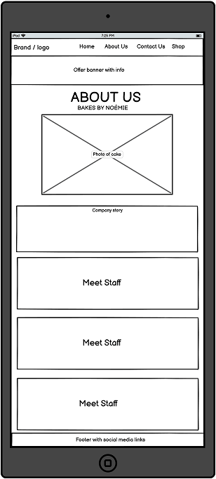

- Contact Us Wireframe

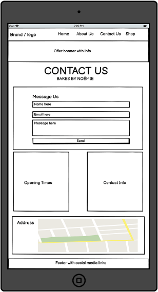

- Shop Wireframe

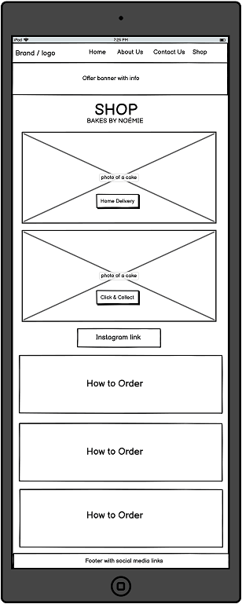

#### Mobile

- Home Page Wireframe

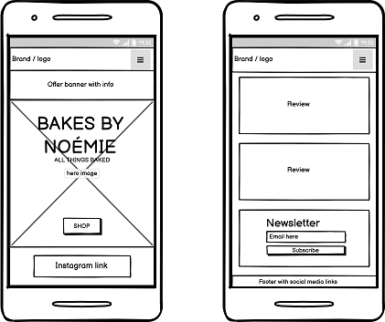

- About Us Wireframe

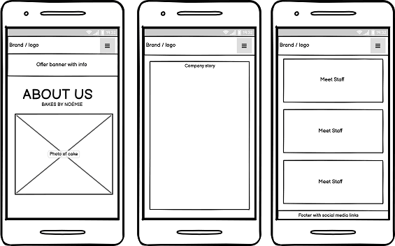

- Contact Us Wireframe

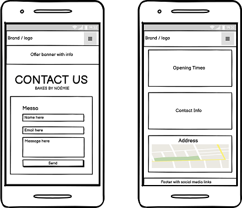

- Shop Wireframe

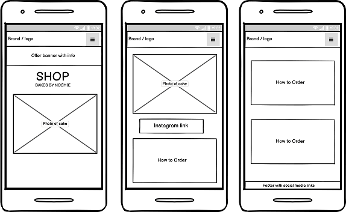

#### Colour Palette
- Equally as important in the baking industry - especially with decorative products, colour is vital for the design of this website.

- The primary colours used on the Bakes by Noémie website are ash gray (#ced4c6), puce (#c6878f) and white (#fff).
There is a hint of navy purple (#5b507a) found to better contrast the text with the hero image on the index.html home page.
The text colour is predominantly a dark black (#000) to ensure a greater contrast between the mellow, pastel colour palette and background.
There is some text content in white - especially when the background is a darker colour or shade.

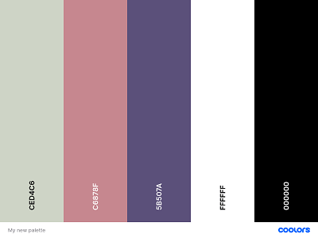

- The ash gray (#ced4c6) colour came from using [Eye Dropper](https://eyedropper.org/). This colour picker tool was used to pick the colour from the company logo used on the Bakes by Noémie [Instagram](https://www.instagram.com/bakesbynoemie/) page.

- It was decided early on in the design stage that this would be the background colour. A pastel colour that was fairly neutral and in no way distracting. It provided a perfect base to layer other colours and content on top of. It is both a visually appealing design and also satisfies the importance of providing an accessible website with high contrast.

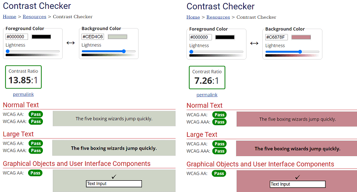

- The [Coolors](https://coolors.co/ced4c6-c6878f-5b507a) website was then used to help choose colours that would compliment the background colour. This helped set-up the vision of creating an aesthetically pleasing website and of course balance everything nicely. The white and black were added to further help with contrast and readability.

#### Images
- The use of photography is vital in creating allure and desire, especially for a bakery. Customers are drawn by what they see. The photographs used are large, light/bright, colourful and hope to entice customers into visiting the shop and purchasing the baked goods.

#### Font
-  The website uses the Poppins font. It seems to be a very popular option amongst youtubers and provides that clean, clear style without compromising on readability. This is available for free via [Google Fonts](https://fonts.google.com/) and imported via CSS. Sans Serif is used as a secondary option in case of failure to import.  font in case for any reason the font isn't being imported into the site correctly. Montserrat is a clean font used frequently in programming, so it is both attractive and appropriate.
- A more stylistic font was initially considered, but due to the readability it was opted to go for a very clean, clear and readable font.


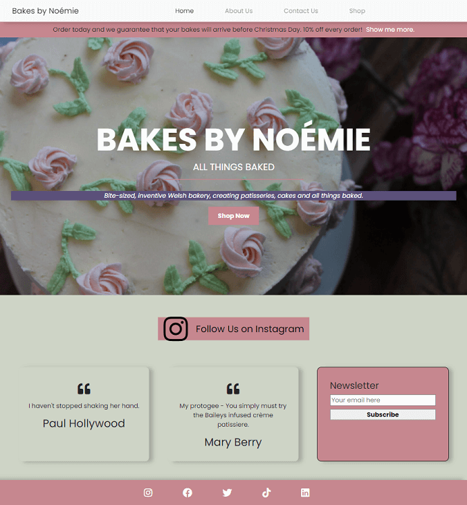

## Accessibility
Extremely important aspect.
-   Semantic design.
-   The use of alt to describe images and other content.
-   Aria-labelledby to link sections of each webpage together.
-   Colour and contrast considerations and testing.
-   Adding labels to forms.

## Features

-   Responsive on all device sizes - from 320px upwards to larger desktops reaching 1200px and more.

## Interactive Elements

-   There are many interactive elements to the website.

#### Navbar

As shown on the images below, the nav bar has a consistent and clean style. it is completely responsive, with a toggle menu appearing for smaller screen sizes of 767px and under. This was based on Boostraps own nav [documentation](https://getbootstrap.com/docs/4.0/components/navbar/), which I then styled myself and altered classes. The company's name is always visible, which is very important for consistency and brand exposure and familiarity. Having the company's name present as a logo, also allows the user to instinctively click on it to return to the home page.

- Desktop Navbar

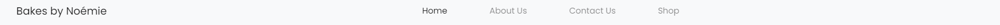

- Tablet Navbar

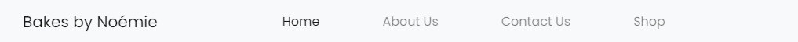

- Mobile Navbar

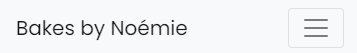

- Mobile Navbar when clicked, opens up the navigation links

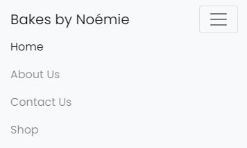

#### Footer

- Desktop Footer & Tablet Footer

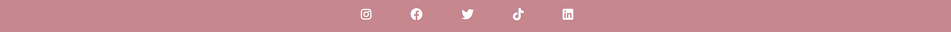

- Mobile Footer

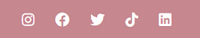

#### Modal

- The modal appears when the "Show me more" link on the offer banner just below the navbar. Functions on mobile, tablet, laptop and larger desktops.

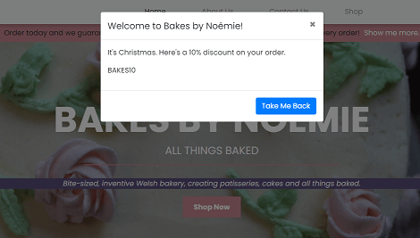

#### Buttons

- Every button is styled to look the same.

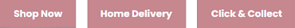

- The colours simply invert when a cursor hovers over them. A simple visual indicator and keeping in line with the colour palette.

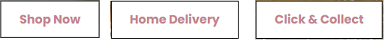

#### Instagram link

- The Instagram link appears centrally on both the index.html and shop.html. webpages. It serves as a visual reminder to check the company's social media account. This aims to drive up visitors and curiosity.

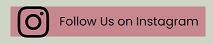

#### Newsletter

- The Newsletter found on the index.html page requires validation before accepting the user input.

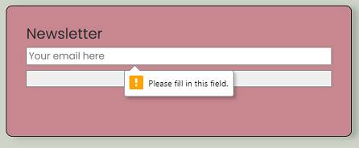

- When user successfully complies with prompted validation, they are met with the following screen.
- This screen is taken from the [Code Institute](https://codeinstitute.net/) template, and is used just for the purpose of showing a successful action.

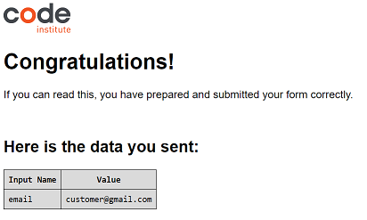

#### Message Us

- As with the Newsletter feature seen above, the Message Us form on the contact.html page also requires validation before the user can submit their data.

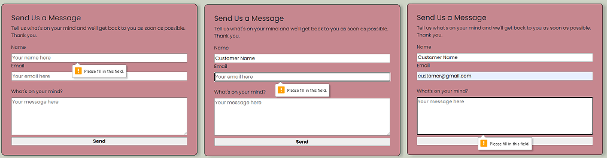

- As with the Newsletter feature, the user will be met with the same Code Institute webpage informing them that the data was input successfully.

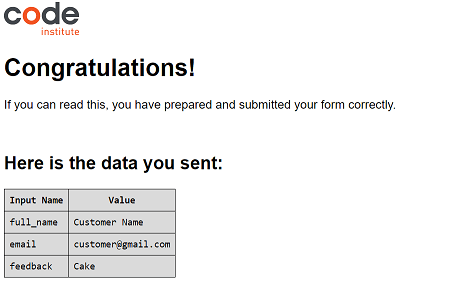

#### Google Maps

- [Google Maps](https://www.google.com/maps) was used to provide an interactive map on the Contact Us page. It was embedded as an iframe and then styled further.


## Technologies Used

### Languages Used

-   [HTML5](https://en.wikipedia.org/wiki/HTML5)
-   [CSS3](https://en.wikipedia.org/wiki/Cascading_Style_Sheets)

### Frameworks, Libraries & Programs Used

1. [Bootstrap 4.6.0:](https://getbootstrap.com/docs/4.6/getting-started/introduction/)
    - Bootstrap was used to assist with the responsiveness and styling of the website.
1. [Hover.css:](https://ianlunn.github.io/Hover/)
    - Hover.css was used on the Social Media icons in the footer to add the float transition while being hovered over.
1. [Google Fonts:](https://fonts.google.com/)
    - Google fonts were used to import the 'Titillium Web' font into the style.css file which is used on all pages throughout the project.
1. [Font Awesome:](https://fontawesome.com/)
    - Font Awesome was used on all pages throughout the website to add icons for aesthetic and UX purposes.
1. [jQuery:](https://jquery.com/)
    - jQuery came with Bootstrap to make the navbar responsive but was also used for the smooth scroll function in JavaScript.
1. [Git](https://git-scm.com/)
    - Git was used for version control by utilizing the Gitpod terminal to commit to Git and Push to GitHub.
1. [GitHub:](https://github.com/)
    - GitHub is used to store the projects code after being pushed from Git.
1. [TinyPNG:](https://tinypng.com/)
    - TinyPNG is used to optimize images used in the project.
1. [Miscrosoft Paint:](https://support.microsoft.com/en-us/windows/get-microsoft-paint-a6b9578c-ed1c-5b09-0699-4ed8115f9aa9)
    - Microsoft Paint was used to crop and resize images and editing photos for the project.
1. [Balsamiq:](https://balsamiq.com/)
    - Balsamiq was used to create the [wireframes](https://github.com/) during the design process.

## Testing

The W3C Markup Validator and W3C CSS Validator Services were used to validate every page of the project to ensure there were no syntax errors in the project.

-   [W3C Markup Validator](https://jigsaw.w3.org/css-validator/#validate_by_input)

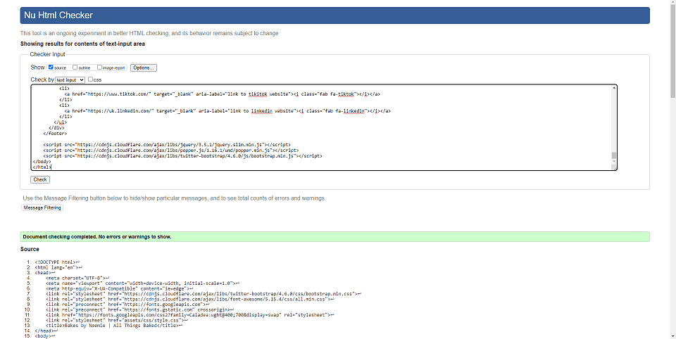

-   [W3C CSS Validator](https://jigsaw.w3.org/css-validator/#validate_by_input) 

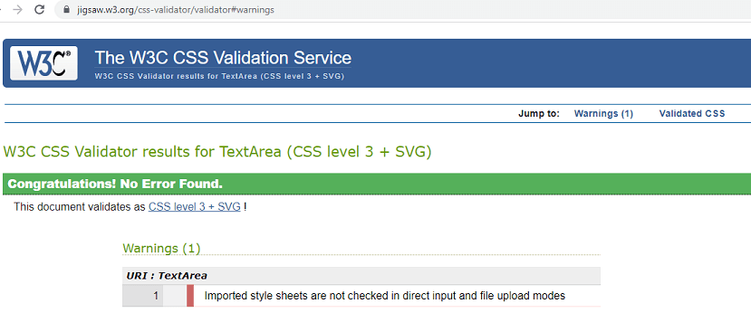

## Testing

Following are the Google Chrome Lighthouse results for each page.

- Home page

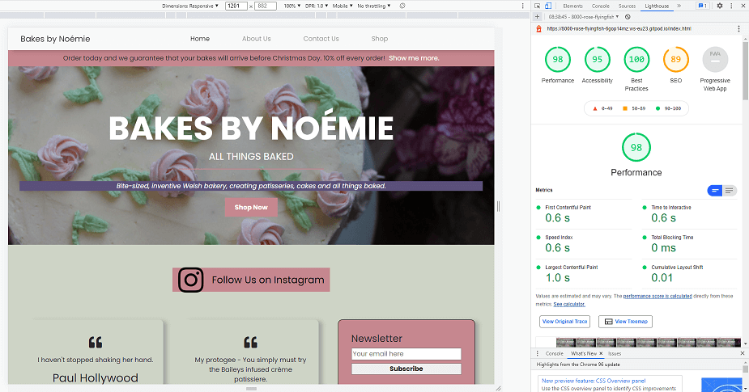

- About Us page

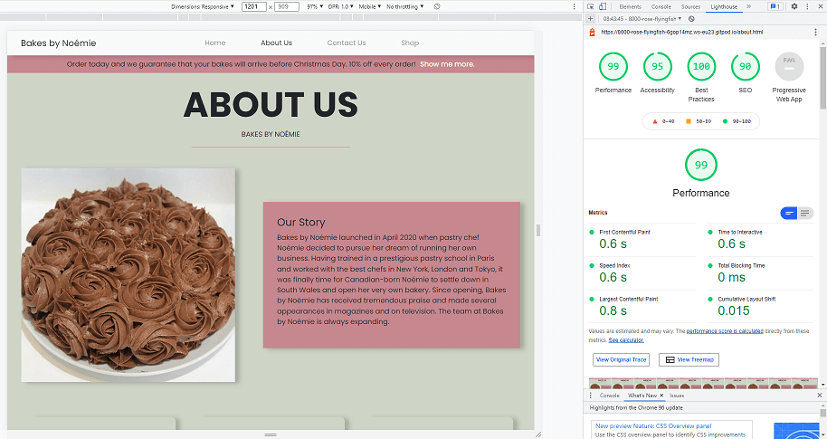

- Contact Us page

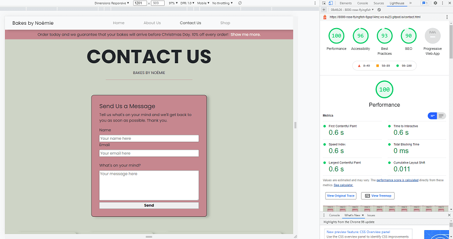

- Shop page


### Further Testing

-   Testing was predominantly made using Google Chrome's own developer tools and 'Inspect Mode', although testing was done sporadically on alternative browsers with each major addition to the website e.g. new content or responsive changes via keyframes.
-   The Website was tested on Google Chrome, Mozilla Firefox, Microsoft Edge and Opera browsers.
-   The website was viewed on a variety of devices such as Desktop, Laptop, iPad & iPhoneX.

-   I had feedback throughout from Noémie herself, who gave guidance and a critical eye throughout.

### Bug Fixes

-   As seen from the style.css file, there is a lot of custom css. I manually adjusted each screen size and the layout, often times changing the display from flex/flexbox to inline on smaller screens - then adjusting the width of the containers.
-   There was an issue on the iPad where the navbar would push the white background and links down to cover the 'offer banner' below. This was due to my custom padding settings overriding bootstraps own classes. This was resolved by changing it's property to "width: max-content" on a media query from 768px and up.

-   There was an issue on smaller screens where the footer social media links - via Font Awesome icons - were stacking untidily and creating padding issues. This was resolved by creating a media query to reduce the icon sizes at the relevant breakpoint for smaller screens.

-   Added rel-"noopener" to external links opening in new tabs for securirty purposes.

### Known Bugs

-   The navbar menu links are slightly off-centre, although the navbar is responsive and moves with the width of the screen.
-   The footer can rise up when there is a lack of content on a webpage. This is something to consider for future content adjustments.

## Deployment

### GitHub Pages

The project was deployed to GitHub Pages using the following steps...

1. Log in to GitHub and locate the [GitHub Repository](https://github.com/)
2. At the top of the Repository (not top of page), locate the "Settings" Button on the menu.
    - Alternatively Click [Here](https://raw.githubusercontent.com/) for a GIF demonstrating the process starting from Step 2.
3. Scroll down the Settings page until you locate the "GitHub Pages" Section.
4. Under "Source", click the dropdown called "None" and select "Master Branch".
5. The page will automatically refresh.
6. Scroll back down through the page to locate the now published site [link](https://github.com) in the "GitHub Pages" section.

### Forking the GitHub Repository

By forking the GitHub Repository we make a copy of the original repository on our GitHub account to view and/or make changes without affecting the original repository by using the following steps...

1. Log in to GitHub and locate the [GitHub Repository](https://github.com/)
2. At the top of the Repository (not top of page) just above the "Settings" Button on the menu, locate the "Fork" Button.
3. You should now have a copy of the original repository in your GitHub account.

### Making a Local Clone

1. Log in to GitHub and locate the [GitHub Repository](https://github.com/)
2. Under the repository name, click "Clone or download".
3. To clone the repository using HTTPS, under "Clone with HTTPS", copy the link.
4. Open Git Bash
5. Change the current working directory to the location where you want the cloned directory to be made.
6. Type `git clone`, and then paste the URL you copied in Step 3.

```
$ git clone https://github.com/YOUR-USERNAME/YOUR-REPOSITORY
```

7. Press Enter. Your local clone will be created.

```
$ git clone https://github.com/YOUR-USERNAME/YOUR-REPOSITORY
> Cloning into `CI-Clone`...
> remote: Counting objects: 10, done.
> remote: Compressing objects: 100% (8/8), done.
> remove: Total 10 (delta 1), reused 10 (delta 1)
> Unpacking objects: 100% (10/10), done.
```

Click [Here](https://help.github.com/en/github/creating-cloning-and-archiving-repositories/cloning-a-repository#cloning-a-repository-to-github-desktop) to retrieve pictures for some of the buttons and more detailed explanations of the above process.

## Credits

### Code
-   At the early stages of the development, [Bootstrap4](https://getbootstrap.com/docs/4.6/getting-started/introduction/) code was used to create responsive containers throughout the website. I would use their principal code for building the layout via containers, rows and columns then add my own content, elements or adjust their pre-determined classes.
Later on in the development I removed the majority of the bootstrap code and built custom sections, containers and content with custom css. This decision was made after viewing [MS1 Preparation and CSS Positioning by Suzy Bennett](https://www.youtube.com/watch?v=N4bhJ4u29Do)'s YouTube video.

- The navbar keeps Bootstrap's own code, although I have added my own css to it to fit the website layout and responsiveness. I used some of Bootstraps own classes to further customize their default navbar.

### Inspiration

-   The idea of the offer banner found just under the navbar was taken from [Code Institute](https://codeinstitute.net/)'s 'Whiskey Drop' banner although I styled and created the html aspects myself.

### Content

-   The hero image on the index.html webpage is owned by Noémie Fradette of Bakes by Noémie.

-   https://www.w3schools.com/howto/howto_css_button_on_image.asp

-   This README.md document was based on Code Institute's [template](https://github.com/Code-Institute-Solutions/SampleREADME/blob/master/README.md) .


### Media

-   The images found on the About Us, Meet the Team section were found [here](https://www.pexels.com/photo/woman-with-short-and-curly-hair-smiling-7665706/) [here](https://www.pexels.com/photo/portrait-photo-of-woman-in-sunglasses-and-black-hat-2245383/) and [here](https://www.pexels.com/photo/selective-focus-photo-of-woman-smiling-3936894/).

-   All other Images were created by Noémie Fradette of Bakes by Noémie.

### Acknowledgements

-   My Mentor for helpful feedback.

-   Tutor support at Code Institute for their support.

-   The Slack community.